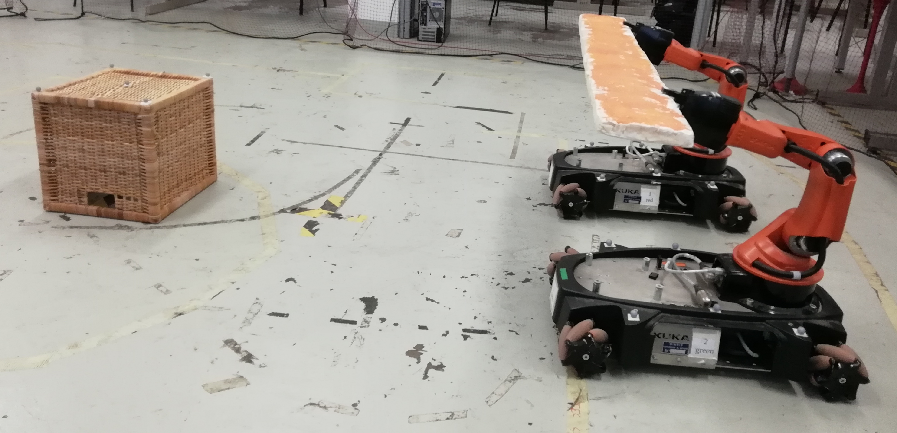

# ObstacleAvoidanceYouBot_GP
Presentation slide and Report for Group Project for Robotics Engineering course 2017/18: Obstacle Avoidance in a Cooperative Object Trasportation

    

Note that this repository comprends only the presentation of the work  and the Report (so, no code because it is, someway, private and belonging in great part to others people)

## Video
Video visible [here](https://streamable.com/dyxd8)

##### Group Project done in collaboration with
[fafux](https://github.com/fafux)
